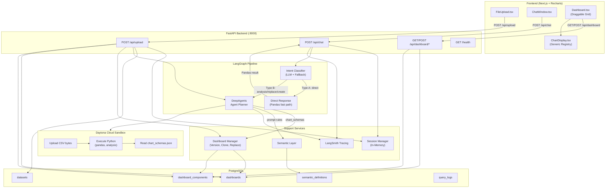
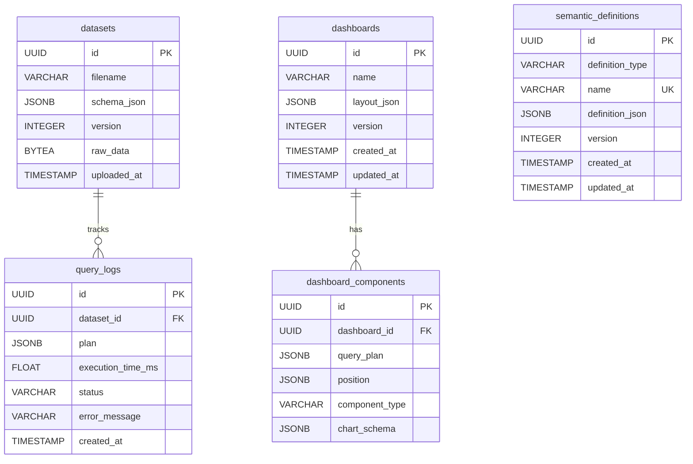

# System Architecture: InsightAI — Workforce Intelligence Platform

## Overview

This document describes the system architecture, data flow, component interactions, and design decisions for the InsightAI platform.

**Core Concept**: Transform CSV datasets into an interactive, AI-driven analytics dashboard with version-controlled state, secure cloud-sandbox execution, and schema-driven visualizations.

**Architecture Style**: Layered deep-agent pipeline with persistent PostgreSQL storage and ephemeral cloud sandboxing.

---

## System Architecture Diagram



---

## Data Flow: Upload & Chat

### 1. File Upload Flow

```
User selects CSV file
        │
        ▼
┌──────────────────────────────┐
│ Frontend: FileUpload.tsx     │ - Validate file type = .csv
│                              │ - Trigger upload
└────────────┬─────────────────┘
             │
             ▼ POST /api/upload {file: FormData}
        ┌────────────────────────────────────┐
        │ Backend: routes/upload.py          │
        │                                    │
        │ 1. Create session (in-memory)      │
        │ 2. Validate file size ≤ 10 MB      │
        │ 3. Parse CSV with Pandas           │
        │ 4. Extract metadata & preview      │
        │ 5. Save raw bytes → DB (datasets)  │
        └────────────┬───────────────────────┘
                     │
                     ▼
        ┌────────────────────────────────────┐
        │ Auto-Insights Generation           │
        │                                    │
        │ 1. Fetch chart rules from          │
        │    semantic_definitions table       │
        │ 2. Invoke DeepAgents agent in      │
        │    Daytona sandbox                 │
        │ 3. Agent generates 3-4 overview    │
        │    charts as JSON schemas          │
        │ 4. Agent provides text insights    │
        └────────────┬───────────────────────┘
                     │
                     ▼
        ┌────────────────────────────────────┐
        │ Dashboard Persistence              │
        │                                    │
        │ 1. Create Dashboard record (v1)    │
        │ 2. Create DashboardComponent for   │
        │    each chart schema               │
        │ 3. Create insight component for    │
        │    text summary                    │
        │ 4. Link dashboard_id to session    │
        └────────────┬───────────────────────┘
                     │
                     ▼
        Return: {session_id, dashboard_id,
                 metadata, chart_schemas, insights}
        ┌────────────────────────────────────┐
        │ Frontend: Store IDs in localStorage│
        │ Render dashboard via Dashboard.tsx │
        └────────────────────────────────────┘
```

### 2. Chat Query Flow

```
User sends: "Replace the pie chart with a bar chart"
        │
        ▼
┌────────────────────────────────────┐
│ Frontend: api-client.ts            │
│                                    │
│ 1. Client-side intent parsing      │
│    → {intent: "replace",           │
│       params: {source: "pie",      │
│                target: "bar"}}     │
│ 2. POST /api/chat with             │
│    parsed_command attached         │
└────────────┬───────────────────────┘
             │
             ▼ POST /api/chat {session_id, message, parsed_command}
        ┌────────────────────────────────────┐
        │ Backend: routes/chat.py            │
        │ (LangSmith-traced)                 │
        │                                    │
        │ → Delegates to pipeline.py         │
        └────────────┬───────────────────────┘
                     │
                     ▼
        ┌────────────────────────────────────┐
        │ pipeline.py: process_chat_request  │
        │                                    │
        │ 1. Load session                    │
        │ 2. Fetch raw CSV bytes from DB     │
        │ 3. Use parsed_command or run       │
        │    LangGraph intent classifier     │
        └────────────┬───────────────────────┘
                     │
              ┌──────┴──────┐
              │             │
           Type A        Type B/Replace
         (Direct)       (Analysis)
              │             │
       ┌──────▼──────┐     │
       │ nlp_query_  │     │
       │ executor.py │     │
       │ Local Pandas│     │
       │ NO CHARTS   │     │
       └──────┬──────┘     │
              │             │
              │      ┌──────▼──────────────────┐
              │      │ agent_planner.py         │
              │      │                          │
              │      │ 1. Create Daytona sandbox│
              │      │ 2. Upload CSV bytes      │
              │      │ 3. Build system prompt   │
              │      │    with chart rules,     │
              │      │    dataset metadata,     │
              │      │    current widgets list  │
              │      │ 4. Create DeepAgent      │
              │      │ 5. Agent generates &     │
              │      │    executes Python code  │
              │      │ 6. Agent writes results  │
              │      │    to chart_schemas.json │
              │      │ 7. Download & parse JSON │
              │      │ 8. Clean NaN values      │
              │      │ 9. Delete sandbox        │
              │      └──────┬──────────────────┘
              │             │
              │      ┌──────▼──────────────────┐
              │      │ Dashboard Versioning     │
              │      │                          │
              │      │ 1. Clone current dash    │
              │      │    → new version (v+1)   │
              │      │ 2. Apply changes:        │
              │      │    - replace_id match    │
              │      │    - title keyword match │
              │      │    - or append new widget│
              │      │ 3. Update session with   │
              │      │    new dashboard_id      │
              │      └──────┬──────────────────┘
              │             │
              ▼             ▼
        ┌────────────────────────────────────┐
        │ ChatResponse to Frontend           │
        │ {content, chart_schema,            │
        │  dashboard_id, execution_time_ms}  │
        └────────────────────────────────────┘
              │
              ▼
        Frontend refreshes dashboard widgets
        from /api/dashboard/{session_id}
```

---

## LangGraph Intent Classification

### StateGraph Definition

The intent classifier is a compiled LangGraph `StateGraph` with two nodes:

```
START → classify → validate → END
```

1. **classify**: Sends the user message to Azure OpenAI with a structured prompt requesting JSON output (`{intent, params}`).
2. **validate**: Normalizes the LLM response — validates intent enum values, normalizes chart type synonyms (e.g., "column" → "bar"), and wraps into a `ParsedCommand` object.

### Intent Types

```python
class IntentType(str, Enum):
    DIRECT = "direct"          # Simple text queries (Lightweight NLP, No Charts)
    DATA_QUERY = "data_query"  # Complex calculations (DeepAgent, No Charts)
    ANALYSIS = "analysis"      # Visualizations (DeepAgent Sandbox, Charts Allowed)
    REPLACE = "replace"        # Replace existing chart with different type
    CREATE = "create"          # Add new chart
    MODIFY = "modify"          # Modify existing chart properties
```

### Fallback Mechanism

If the LLM call fails, the classifier falls back to keyword matching:
- **Replace keywords**: `replace`, `swap`, `change`, `switch`, `instead`
- **Analysis keywords**: `plot`, `chart`, `visual`, `graph`, `show`, `create`, `add`
- **Direct keywords**: `how many`, `missing`, `duplicate`, `summary`, `count`

---

## DeepAgents + Daytona Sandbox Execution

### Execution Flow

```
generate_analysis_code()
        │
        ├── 1. Daytona() → create sandbox
        ├── 2. sandbox.fs.upload_file(raw_csv_bytes, "/home/daytona/data.csv")
        ├── 3. Upload Context:
        │      - sandbox.fs.upload_file(dashboard_schemas.json)  # Full widget metadata
        │      - sandbox.fs.upload_file(dashboard_helpers.py)    # Agent query utility
        ├── 4. Build system prompt with:
        │      - Dataset metadata (columns, dtypes, preview rows)
        │      - Chart template rules from semantic_definitions
        │      - Lightweight widget summary list (ID, type, title)
        │      - Instructions on using `dashboard_helpers.py` for chart discovery
        ├── 5. create_deep_agent(model=AzureChatOpenAI, backend=DaytonaSandbox)
        ├── 6. agent.invoke() → generates & executes Python code
        ├── 7. sandbox.fs.download_file("/home/daytona/chart_schemas.json")
        ├── 8. Parse JSON, clean NaN values, strip markdown artifacts
        └── 9. sandbox.delete() (always, via finally block)
```

### Agent Constraints

The system prompt enforces strict rules:
- **No matplotlib/PNG** — Agent must output JSON chart schemas only
- **Column validation** — Agent must verify column names before generating code
- **Standardized output path** — All schemas written to `/home/daytona/chart_schemas.json` (even for chart replacements)
- **Install dependencies** — First code step always installs pandas via pip
- **No code in response** — Final text response is stripped of all code blocks and file paths
- **Self-Serve Chart Discovery** — Agent uses `dashboard_helpers.py` to identify `replace_id` targets instead of relying on pre-parsed backend orchestration.
- **Conversational Fallback** — If a chart target is ambiguous (e.g., multiple pie charts found), the agent is instructed to ask the user for clarification rather than guessing or replacing randomly.

### Harness Profile

DeepAgents is configured with `HarnessProfileConfig` that excludes `AnthropicPromptCachingMiddleware` for both `openai` and `azure` profiles, since only Azure OpenAI is used.

---

## Dashboard Versioning System

### Version Lifecycle

```
Upload CSV → Dashboard v1 (auto-generated charts)
     │
     ▼
Chat: "Show salary trends" → Clone v1 → Dashboard v2 (add chart)
     │
     ▼
Chat: "Replace pie with bar" → Clone v2 → Dashboard v3 (replace chart)
     │
     ▼
Rollback to v1 → Session now points to v1's dashboard_id
```

### Clone Strategy (`dashboard_manager.py`)

1. **create_dashboard_version**: Copies the `Dashboard` record with `version + 1`, then clones all `DashboardComponent` records to the new dashboard.
2. **apply_dashboard_changes**: Processes chart schemas against the cloned components:
   - If `replace_id` matches a component → update its `chart_schema` in place
   - If title keywords match an existing component → update it (fuzzy match: words > 3 chars)
   - Otherwise → append as a new component at the bottom of the grid

### Rollback

The rollback endpoint simply updates the session's `dashboard_id` to point to a previous version's UUID. The old version's data is untouched in PostgreSQL.

---

## Database Schema (PostgreSQL)

### Entity-Relationship Diagram



### Semantic Definitions (Chart Templates)

Seeded on startup by `init_db()` if the table is empty:

| Name | Description |
|------|-------------|
| `bar` | Category comparisons (xAxis = category, yAxis = value) |
| `pie` | Proportional distributions (name + value) |
| `line` | Trends over time (x = time, y = metric) |
| `area` | Cumulative trends |
| `scatter` | Correlations (x, y numeric) |
| `radar` | Multi-dimensional comparisons (dimension + value) |

Each template includes a full JSON schema with `type`, `description`, `required_fields`, and `example`.

---

## Pydantic Data Models

### Session Model

```python
class SessionModel(BaseModel):
    session_id: str
    created_at: datetime
    last_accessed_at: datetime
    dataset: Optional[DatasetMetadata]
    chat_history: list[ChatMessage]
    metadata: dict  # Stores dashboard_id, etc.
```

### DatasetMetadata

```python
class DatasetMetadata(BaseModel):
    filename: str
    dataset_id: str           # UUID from PostgreSQL
    file_path: str            # Empty (no disk storage)
    rows: int
    columns: list[str]
    dtypes: dict[str, str]
    missing_values: dict[str, int]
    preview_rows: list[dict]  # First 5 rows
    size_bytes: int
    uploaded_at: datetime
```

### Chat Models

```python
class ChatRequest(BaseModel):
    session_id: str
    message: str
    parsed_command: Optional[dict]  # Pre-parsed intent from frontend

class ChatResponse(BaseModel):
    role: str = "assistant"
    content: str
    chart_schema: Optional[dict]
    execution_time_ms: Optional[int]
    dashboard_id: Optional[str]     # New version UUID after changes
    version: Optional[int]
    error_message: Optional[str]
```

### Upload Response

```python
class UploadResponse(BaseModel):
    session_id: str
    dashboard_id: Optional[str]       # Persisted dashboard UUID
    message: str
    metadata: DatasetMetadata
    default_chart_schemas: list[dict]  # Auto-generated charts
    auto_insights: Optional[str]      # Text summary
```

---

## Frontend Architecture

### Component Hierarchy

```
index.tsx (Page)
├── FileUpload.tsx          ─ CSV upload trigger
├── ChatWindow.tsx          ─ Conversational interface
│   └── ChartDisplay.tsx    ─ Inline chart preview
└── Dashboard.tsx           ─ Main analytics grid
    └── ChartDisplay.tsx    ─ Widget-level chart rendering
```

### Chart Rendering Engine (`ChartDisplay.tsx`)

Uses a **component registry** pattern — no switch/case logic:

```typescript
const CHART_REGISTRY = {
  bar:     { wrapper: BarChart,     element: Bar,     hasAxes: true },
  line:    { wrapper: LineChart,    element: Line,    hasAxes: true },
  area:    { wrapper: AreaChart,    element: Area,    hasAxes: true },
  scatter: { wrapper: ScatterChart, element: Scatter, hasAxes: true },
  pie:     { wrapper: PieChart,     element: Pie,     hasAxes: false, isPolar: false },
  radar:   { wrapper: RadarChart,   element: Radar,   hasAxes: false, isPolar: true },
};
```

The renderer:
1. Looks up `schema.type` in the registry
2. Falls back to `scatter` for unknown types
3. Coerces string numbers to actual numbers
4. Auto-detects x/y keys if schema keys are missing from the data
5. Renders with appropriate coordinate system (Cartesian, Polar, or Pie)

### Dashboard Drag-and-Drop (`Dashboard.tsx`)

Implements a **native pointer-event system** (no external grid library):
- **Move**: Pointer-down on header handle → track delta → update grid position
- **Resize**: Pointer-down on corner handle → adjust width/height
- **Grid snapping**: 12-column grid, 100px row height; positions rounded on pointer-up
- **Persistence**: "Save Layout" sends updated positions to `POST /api/dashboard/{session_id}/layout`

### Client-Side Intent Parser (`api-client.ts`)

A regex-based parser runs before sending chat messages, providing a `parsed_command` hint to the backend:
- Replace patterns: `replace X chart with Y chart`
- Create patterns: `create a X chart`, `show me a X chart`
- Analysis patterns: presence of `chart`, `plot`, `graph`, `visualize`
- Direct patterns: `how many`, `missing`, `duplicate`, `summary`

---

## Security & Isolation

### Daytona Sandbox Isolation

- Each analysis request creates an **ephemeral sandbox** — destroyed after use
- CSV data is uploaded as raw bytes; no database connections from the sandbox
- The sandbox **cannot access** the Docker network, PostgreSQL, or host filesystem
- Timeout limits enforced by the Daytona runtime
- Generated code outputs data to stdout and `/home/daytona/chart_schemas.json`

### Code Safety

- Agent prompt is scoped to data analysis only
- `config.py` defines `ALLOWED_IMPORTS` (pandas, numpy, json, etc.) and `FORBIDDEN_IMPORTS` (os, sys, subprocess, etc.)
- Response sanitization strips code blocks, file paths, and technical artifacts

---

## Error Handling Strategy

### Exception Hierarchy

```python
InsightsException (base)
├── InvalidFileFormatError    # Wrong file type
├── FileTooLargeError         # Exceeds MAX_UPLOAD_SIZE
├── CorruptedDataError        # CSV parse failure
├── SandboxError              # Daytona execution failure
├── SessionNotFoundError      # Invalid session_id
└── SessionExpiredError       # TTL exceeded
```

All custom exceptions are caught by the global `InsightsException` handler in `main.py` and returned as structured JSON with appropriate HTTP status codes.

### User-Facing Error Messages

| Error Type | Message |
|-----------|---------|
| Sandbox timeout | "Statistical retrieval failed. Please refine your query." |
| Invalid CSV | "Data ingestion failed. Ensure the CSV format is valid." |
| No dataset | "No dataset has been uploaded for this session." |
| Session expired | "Session has expired. Please re-upload your dataset." |

---

## Observability (LangSmith)

### Traced Components

| Component | Trace Tags |
|-----------|------------|
| `chat_endpoint` | `chat`, `api` |
| `process_chat_request` | `chat`, `pipeline` |
| `classify_intent` | `intent`, `classification`, `langgraph` |
| `parse_command` | `intent`, `parsing`, `langgraph` |
| `generate_analysis_code` | `agent`, `code_generation`, `deepagents` |

### Configuration

```bash
LANGSMITH_TRACING=true
LANGSMITH_ENDPOINT=https://eu.api.smith.langchain.com
LANGSMITH_API_KEY=<your-key>
LANGSMITH_PROJECT=Insights
```

---

## Deployment Architecture

### Docker Compose (3-service stack)

```
┌──────────────────────────────┐
│  insights-frontend (:3000)   │ Next.js dev server
│  depends_on: backend         │
└──────────────┬───────────────┘
               │
┌──────────────▼───────────────┐
│  insights-backend (:8000)    │ FastAPI + uvicorn --reload
│  depends_on: postgres        │
│  env_file: .env.local        │
└──────────────┬───────────────┘
               │
┌──────────────▼───────────────┐
│  insights-postgres (:5433)   │ PostgreSQL 15
│  Volume: postgres-data       │ Health check: pg_isready
└──────────────────────────────┘

Network: insights-network (bridge)
```

### Port Mapping

| Service | Internal | External |
|---------|----------|----------|
| Backend | 8000 | 8000 |
| Frontend | 3000 | 3000 |
| PostgreSQL | 5432 | 5433 |

---

## Performance Characteristics

| Metric | Typical | Notes |
|--------|---------|-------|
| Direct queries (Type A) | < 1 sec | Local Pandas, no sandbox |
| Analysis queries (Type B) | 10–30 sec | Daytona sandbox creation + code execution |
| Upload + auto-insights | 15–45 sec | Includes sandbox + 3-4 chart generation |
| Chart rendering | < 500 ms | Client-side Recharts |
| Dashboard reload | < 1 sec | Direct PostgreSQL fetch by UUID |
| Version rollback | < 500 ms | Session pointer update + widget fetch |

---

## Scalability Path (Future)

```
├─ Redis (Session Store)
│  ├─ Replace in-memory sessions with persistent Redis
│  ├─ Enable multi-instance deployments
│  └─ Request rate limiting
│
├─ Celery/Background Jobs
│  ├─ Async sandbox execution
│  ├─ Upload processing queue
│  └─ Graceful degradation under load
│
├─ Multi-User Auth
│  ├─ JWT-based authentication
│  ├─ Per-user dashboard ownership
│  └─ Role-based access control
│
├─ Advanced Analytics
│  ├─ Predictive models
│  ├─ Time-series forecasting
│  └─ PDF/PowerPoint export
│
└─ Horizontal Scaling
   ├─ Load balancer (nginx)
   ├─ Shared PostgreSQL
   └─ Stateless backend instances
```

---

## References

- [LangGraph Documentation](https://langchain-ai.github.io/langgraph/)
- [LangChain Documentation](https://python.langchain.com/docs/)
- [DeepAgents](https://github.com/deepagents/deepagents)
- [Daytona SDK](https://www.daytona.io/docs)
- [FastAPI Documentation](https://fastapi.tiangolo.com/)
- [SQLAlchemy Async](https://docs.sqlalchemy.org/en/20/orm/extensions/asyncio.html)
- [Recharts Documentation](https://recharts.org/)
- [Pydantic Documentation](https://docs.pydantic.dev/)

---

**Last Updated**: May 2026
**Status**: Production Architecture
**Version**: 2.0
