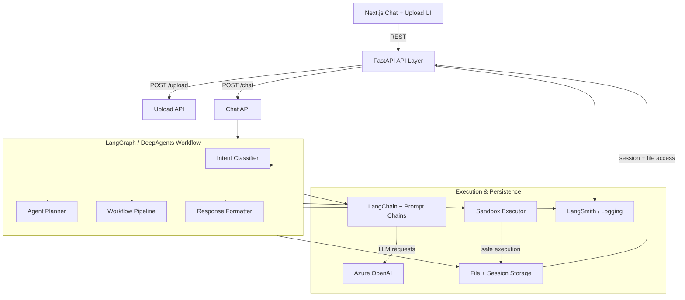

# Employee Dataset Insight Chatbot (MVP v1.0)

An AI-powered chatbot that allows users to upload employee CSV datasets and ask natural language questions about the data using LangGraph, LangChain, and Azure OpenAI.

## Features

- **CSV Upload**: Upload employee datasets with validation (max 10MB)
- **Natural Language Queries**: Ask questions in plain English
- **Dynamic Analysis**: AI-generated Python code for data analysis
- **Chart Generation**: Automatic visualization generation
- **Secure Sandbox**: Isolated code execution with timeout protection
- **Session Management**: Per-user session context and chat history

## Tech Stack

| Layer    | Technology                                 |
| -------- | ------------------------------------------ |
| Frontend | Next.js                                    |
| Backend  | FastAPI                                    |
| Workflow | LangGraph                                  |
| Agent    | LangChain                                  |
| LLM      | Azure OpenAI                               |
| Analysis | Python + Pandas                            |
| Sandbox  | DaytonaSandbox via DeepAgents              |
| Memory   | Redis (optional)                           |
| Logs     | MongoDB (optional)                         |

## Architecture

This project uses a layered hybrid-agent architecture. The frontend provides the user experience, while the backend orchestrates data ingestion, workflow planning, safe code execution, and AI reasoning.

### High-level architecture
- `Next.js` frontend: Chat-based UI, file upload, and interactive dataset visualization.
- `FastAPI` backend: REST API endpoints for upload and query handling.
- `LangGraph`: Graph-based workflow orchestration that treats each processing stage as an agent node.
- `LangChain`: LLM chain orchestration inside each agent node, used to execute Azure OpenAI calls, manage prompts, and build reasoning steps.
- `DeepAgents`: A nested agent design where the system composes multiple agent layers — intent classification, planning, execution, formatting — into one end-to-end analysis pipeline.
- `DaytonaSandbox + storage`: Secure execution of generated Python code inside the DeepAgents workflow and persistent session/file management.

### Detailed architecture flow
1. User uploads a CSV file through the frontend.
2. FastAPI receives the upload and stores the dataset via `backend/storage/`.
3. The user sends a chat query to the `/chat` endpoint.
4. LangGraph handles the workflow state and routes the request through a chain of agent nodes:
   - `intent_classifier`: decides whether the query is analysis, visualization, or data quality.
   - `agent_planner`: builds a concrete plan and chooses tools.
   - `pipeline`: manages the multi-turn conversation state.
   - `response_formatter`: assembles the final response, including charts and summaries.
5. Each node uses LangChain-style prompting to invoke Azure OpenAI and generate Python analysis code.
6. Generated code runs inside the Daytona sandbox via `backend/workflows/agent_planner.py`, where the DeepAgents workflow uploads the dataset, executes analysis, and retrieves charts.
7. Results are stored in session state and returned to the frontend as structured text, metadata, and optional chart output.

### Architecture diagram



### LangGraph, LangChain, and DeepAgents
- **LangGraph** is the orchestration layer. It defines the workflow graph and controls how data flows between agent nodes. This is the backbone of the system’s “smart pipeline.”
- **LangChain** is used inside each agent node to manage prompt templates, memory, and LLM invocation. It handles the lower-level chain execution for Azure OpenAI calls.
- **DeepAgents** refers to the layered multi-agent design. The system does not rely on a single monolithic model; instead it composes smaller agents for intent detection, planning, execution, and response formatting.

### Backend component responsibilities
- `backend/routes/`: Public API layer for uploading datasets and sending chat queries.
- `backend/workflows/`: Agent and workflow logic that implements LangGraph state machines and DeepAgents orchestration, including Daytona sandbox execution.
- `backend/storage/`: Data persistence for uploaded CSVs and active session context.
- `backend/models/`: Typed schemas for requests, responses, datasets, and sessions.
- `backend/utils/`: Logging, error handling, and observability integration.

### Data flow summary
- Input: CSV upload + user query
- Planning: LangGraph routes request to the correct agent chain
- Reasoning: LangChain prompts Azure OpenAI for analysis and code generation
- Execution: sandboxed Python executes analysis scripts and returns structured results
- Output: Final response delivered to the UI, including text, charts, and metadata

## Project Structure

A comprehensive overview of the repository's architecture, including core modules and infrastructure components.

```text
Insights/
├── backend/                        # FastAPI service layer
│   ├── __init__.py
│   ├── main.py                     # App entry point & app lifecycle
│   ├── config.py                   # Environment & credential management
│   ├── requirements.txt            # Backend dependencies
│   ├── tmp_serializer_test.py      # Temporary test utility
│   ├── models/                     # Pydantic data schemas
│   │   ├── __init__.py
│   │   ├── dataset.py
│   │   └── session.py
│   ├── routes/                     # API endpoint definitions
│   │   ├── __init__.py
│   │   ├── chat.py
│   │   └── upload.py
│   ├── workflows/                  # LangGraph agentic pipelines
│   │   ├── __init__.py
│   │   ├── agent_planner.py
│   │   ├── intent_classifier.py
│   │   ├── pipeline.py
│   │   └── response_formatter.py
│   ├── sandbox/                    # Placeholder package (sandbox execution now handled by workflows)
│   │   └── __init__.py
│   ├── storage/                    # File & session persistence
│   │   ├── __init__.py
│   │   ├── file_manager.py
│   │   └── session_manager.py
│   ├── utils/                      # Shared utility modules
│   │   ├── __init__.py
│   │   ├── error_handler.py
│   │   ├── langsmith_tracer.py
│   │   └── logger.py
│   └── tests/                      # Automated test suite
│       └── __init__.py
├── frontend/                       # Next.js web interface
│   ├── package.json
│   ├── tsconfig.json
│   ├── next.config.js
│   ├── postcss.config.js
│   ├── tailwind.config.js
│   ├── jest.config.ts
│   ├── pages/                      # File-based routes & page wrappers
│   │   ├── _app.tsx
│   │   ├── _document.tsx
│   │   └── index.tsx
│   ├── components/                 # Reusable UI primitives
│   │   ├── ChartDisplay.tsx
│   │   ├── ChatWindow.tsx
│   │   ├── Dashboard.tsx
│   │   └── FileUpload.tsx
│   ├── hooks/                      # Custom React hooks
│   ├── utils/                      # API client & helper modules
│   │   └── api-client.ts
│   ├── styles/                     # Global CSS and theme styles
│   │   └── globals.css
│   └── public/                     # Static assets
├── docker/                         # Containerization assets
│   ├── backend.dockerfile
│   └── frontend.dockerfile
├── scripts/                        # Automation & setup scripts
│   ├── run-local.bat
│   └── setup.bat
├── docker-compose.yml
├── .env.example
├── .gitignore
├── ARCHITECTURE.md                 # Deep-dive system design
└── README.md                       # Documentation root
```

### Core Backend Modules

#### Entry & Configuration
- **`backend/main.py`**
  The central application hub that initializes FastAPI, configures CORS, and mounts all functional routers. It orchestrates the startup/shutdown events and serves as the primary gateway for the frontend.
- **`backend/config.py`**
  Handles secure loading of environment variables and Azure OpenAI credentials using Pydantic Settings. It ensures that all configuration parameters are validated before the application starts.

#### API Routing (`backend/routes/`)
- **`backend/routes/upload.py`**
  Manages CSV file ingestion, performing initial validation on file size and format before handing off to storage. It returns metadata and a unique session ID for further analysis.
- **`backend/routes/chat.py`**
  The primary interface for natural language interactions, processing user queries through the LangGraph pipeline. It handles session-based context and returns AI-generated insights and visualizations.

#### Agentic Workflows (`backend/workflows/`)
- **`backend/workflows/pipeline.py`**
  Defines the primary LangGraph state machine that coordinates the flow between intent classification and analysis. It manages the persistent state of the conversation across multiple turns.
- **`backend/workflows/intent_classifier.py`**
  A specialized agent that analyzes user input to determine if the request is for data analysis, visualization, or general query. It routes the task to the appropriate processing node.
- **`backend/workflows/agent_planner.py`**
  Generates a step-by-step execution plan for complex data requests, selecting the right tools and parameters. It translates abstract questions into concrete analytical tasks.
- **`backend/workflows/response_formatter.py`**
  Synthesizes the results from code execution into user-friendly natural language responses. It ensures that data tables and charts are correctly integrated into the final output.

#### Secure Sandbox (Daytona)
- **`backend/workflows/agent_planner.py`**
  Creates a Daytona sandbox, uploads the dataset, executes generated Python analysis code, and retrieves charts as needed.
- **Sandbox Execution** is handled through the DeepAgents workflow rather than a legacy local subprocess helper.

#### Data & Storage (`backend/models/` & `backend/storage/`)
- **`backend/models/dataset.py`**
  Defines the structural schema for dataset metadata and column definitions. It provides type safety for data ingestion and ensures consistency across the analytical pipeline.
- **`backend/models/session.py`**
  Models the structure of user sessions and chat history. It enables persistent storage of conversation context, allowing the agent to remember previous interactions.
- **`backend/storage/file_manager.py`**
  Handles the physical storage and retrieval of uploaded CSV files on the server. It manages file naming, directory structure, and cleanup of temporary data.
- **`backend/storage/session_manager.py`**
  Coordinates the persistence of session state to local storage or an external cache like Redis. It provides methods for creating, updating, and expiring user sessions.

#### Utilities (`backend/utils/`)
- **`backend/utils/langsmith_tracer.py`**
  Integrates LangSmith for deep observability and debugging of LLM chains and agentic workflows. It captures detailed traces of every reasoning step for performance tuning.
- **`backend/utils/logger.py`**
  A standardized logging utility that provides consistent formatting and log levels across the entire backend. It facilitates efficient monitoring and troubleshooting in production environments.
- **`backend/utils/error_handler.py`**
  Centralizes exception management by mapping internal errors to standardized HTTP responses. It ensures that the API returns meaningful error messages and status codes to the client.

### Core Frontend Modules

- **`frontend/pages/index.tsx`**
  The primary landing page and workspace layout, managing the integration of the file uploader and chat window. It coordinates the global state for the active analysis session.
- **`frontend/components/ChatWindow.tsx`**
  A responsive chat interface that renders message history and provides real-time feedback during processing. It supports rich-text formatting and embedded chart displays.
- **`frontend/components/FileUpload.tsx`**
  A drag-and-drop component for dataset uploads, providing visual progress indicators and error reporting. It interacts directly with the backend upload API to initialize sessions.
- **`frontend/utils/api-client.ts`**
  A typed wrapper around the Fetch API that simplifies communication with the FastAPI backend. It handles authentication headers, error parsing, and response typing.

## Prerequisites

- Python 3.10+
- Node.js 18+ & npm
- Azure OpenAI API key ([Get one in Azure Portal](https://portal.azure.com/))
- Optional: Redis, MongoDB (for post-MVP features)

## Installation

### 1. Clone Repository

```bash
git clone <repository-url>
cd Insights
```

### 2. Set Up Environment Variables

```bash
# Copy example to .env.local
cp .env.example .env.local

# Edit .env.local and add your Azure OpenAI settings
AZURE_OPENAI_API_KEY=your-key-here
AZURE_OPENAI_ENDPOINT=https://ai-agents-interns-resource.cognitiveservices.azure.com/
AZURE_OPENAI_API_VERSION=2024-12-01-preview
AZURE_OPENAI_MODEL_NAME=gpt-4.1
AZURE_OPENAI_DEPLOYMENT_NAME=gpt-4.1-khushi
```

### 3. Set Up Backend

```bash
# Create Python virtual environment
python -m venv venv

# Activate venv
# On Windows:
venv\Scripts\activate
# On macOS/Linux:
source venv/bin/activate

# Install dependencies
pip install -r backend/requirements.txt
```

### 4. Set Up Frontend

```bash
cd frontend

# Install npm dependencies
npm install

# Return to root
cd ..
```

## Running Locally

### Terminal 1: Start Backend

```bash
# Activate venv first
# On Windows:
venv\Scripts\activate
# On macOS/Linux:
source venv/bin/activate

# Run FastAPI server
python -m uvicorn backend.main:app --reload --host 127.0.0.1 --port 8000
```

Backend runs at: `http://localhost:8000`
- API Documentation: `http://localhost:8000/docs`
- ReDoc: `http://localhost:8000/redoc`

### Terminal 2: Start Frontend

```bash
cd frontend

# Run Next.js development server
npm run dev
```

Frontend runs at: `http://localhost:3000`

## API Endpoints

### File Upload

**POST** `/upload`

Upload a CSV file to create a new analysis session.

**Request:**
```bash
curl -X POST http://localhost:8000/upload \
  -F "file=@employees.csv"
```

**Response:**
```json
{
  "session_id": "sess_abc123def456",
  "message": "Upload successful",
  "metadata": {
    "filename": "employees.csv",
    "rows": 150,
    "columns": ["Name", "Department", "Salary", "Experience", "Gender"],
    "dtypes": {"Name": "object", "Salary": "float64"}
  }
}
```

### Chat / Query Analysis

**POST** `/chat`

Send a natural language query for data analysis.

**Request:**
```json
{
  "session_id": "sess_abc123def456",
  "message": "Show me average salary by department"
}
```

**Response:**
```json
{
  "role": "assistant",
  "content": "Based on the dataset, here's the average salary by department:\n\nIT: $95,000\nSales: $75,000\nHR: $65,000",
  "chart_url": "data:image/png;base64,iVBORw0KGgoAAAANS...",
  "execution_time_ms": 2500
}
```

## Usage Examples

### Example 1: Dataset Analysis

```
User: Analyze this dataset
Assistant: 
✓ Total employees: 150
✓ Average salary: $82,500
✓ Missing values: 2 records (Name)
✓ Top insights:
  - IT department has highest avg salary ($95K)
  - Gender split: 60% male, 40% female
```

### Example 2: Visualization

```
User: Show gender vs salary chart
Assistant: [PNG chart showing salary distribution by gender]
```

### Example 3: Data Quality

```
User: Are there any duplicates?
Assistant: Yes, found 3 duplicate rows (same Name and Department).
Recommendations:
  1. Review employee IDs
  2. Consider deduplication strategy
```

## Supported Analysis Types

### Summary Requests
- "Analyze this dataset"
- "Give me top insights"
- "Show salary summary"

### Comparison Requests
- "Compare IT vs Sales salaries"
- "Male vs female average salary"

### Visualization Requests
- "Show gender vs salary"
- "Plot department headcount"
- "Experience vs salary chart"

### Data Quality Requests
- "Missing values"
- "Duplicate rows"
- "Invalid records"

## Configuration

### Environment Variables

Edit `.env.local` to customize:

```bash
# Sandbox limits
SANDBOX_TIMEOUT=20              # Seconds
MAX_UPLOAD_SIZE=10485760        # 10 MB in bytes

# Server
FASTAPI_PORT=8000
NEXT_PUBLIC_API_URL=http://localhost:8000

# Session
SESSION_TIMEOUT_HOURS=24
```

## Running Tests

```bash
# Backend tests
pytest backend/tests/ -v

# With coverage
pytest backend/tests/ --cov=backend --cov-report=html
```

## Development Workflow

1. Create a feature branch: `git checkout -b feature/your-feature`
2. Make changes and test locally
3. Run tests: `pytest backend/tests/`
4. Commit: `git commit -m "feat: description"`
5. Push: `git push origin feature/your-feature`
6. Create Pull Request

## Limitations (MVP)

- ❌ Single file upload per session
- ❌ No multi-user authentication
- ❌ No export to PDF/PowerPoint
- ❌ No scheduled reports
- ❌ No predictive analytics

(These will be added in post-MVP releases)

## Performance Targets

| Metric                   | Target |
| ------------------------ | ------ |
| Standard response        | <3 sec |
| Chart generation         | <8 sec |
| Upload success rate      | >95%   |
| Query success rate       | >90%   |
| Error rate               | <5%    |

## Troubleshooting

### Backend won't start
```bash
# Ensure venv is activated
venv\Scripts\activate  # Windows

# Clear Python cache
rm -rf __pycache__ backend/__pycache__

# Reinstall dependencies
pip install -r backend/requirements.txt
```

### Azure OpenAI API key error
```bash
# Verify .env.local has AZURE_OPENAI_API_KEY set
cat .env.local | grep AZURE_OPENAI_API_KEY

# Ensure azure endpoint and deployment are configured correctly
``` 

### Port already in use
```bash
# Change port in .env.local or CLI
python -m uvicorn backend.main:app --port 8001
```

## Documentation

- [Architecture Guide](ARCHITECTURE.md) — System design and data flow
- [API Documentation](http://localhost:8000/docs) — Interactive API explorer
- [LangGraph Docs](https://langchain-ai.github.io/langgraph/) — Workflow documentation
- [FastAPI Docs](https://fastapi.tiangolo.com/) — Backend framework

## License

MIT License - See LICENSE file

## Support

For issues or questions:
1. Check [Troubleshooting](#troubleshooting) section
2. Review [ARCHITECTURE.md](ARCHITECTURE.md)
3. Open an issue on GitHub

## Contributing

Contributions are welcome! Please follow the development workflow above and ensure tests pass.


