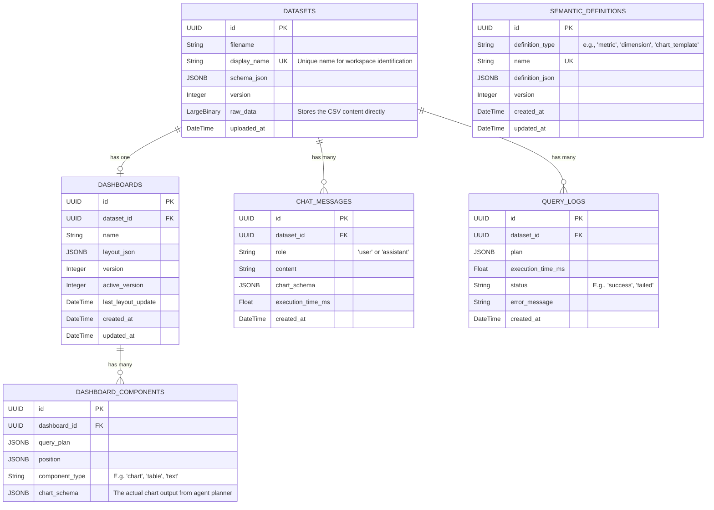

# Database Schema Documentation

This document provides a comprehensive overview of the PostgreSQL database schema used in the Insights application.

## Entity-Relationship Diagram

## Tables Details

### 1. `datasets`
Stores dataset schema, version, and the raw CSV bytes.

| Column | Type | Constraints | Description |
| :--- | :--- | :--- | :--- |
| `id` | UUID | Primary Key | Auto-generated UUID (`uuid4`). |
| `filename` | String | Not Null | Original filename of the uploaded dataset. |
| `display_name` | String | Unique, Nullable | Unique name for workspace identification. |
| `schema_json` | JSONB | Not Null | Structured JSON describing the dataset schema. |
| `version` | Integer | Not Null, Default `1` | Dataset version tracking. |
| `raw_data` | LargeBinary | Not Null | Stores the CSV content directly. |
| `uploaded_at` | DateTime | Default `utcnow` | Timestamp of upload. |

### 2. `dashboards`
Stores dashboard configurations (layout) linked to a specific dataset.

| Column | Type | Constraints | Description |
| :--- | :--- | :--- | :--- |
| `id` | UUID | Primary Key | Auto-generated UUID (`uuid4`). |
| `dataset_id` | UUID | FK (`datasets.id`), On Delete CASCADE, Not Null | Link to the parent dataset. |
| `name` | String | Not Null | Name of the dashboard. |
| `layout_json` | JSONB | Not Null | The full layout configuration for rendering the dashboard. |
| `version` | Integer | Not Null, Default `1` | Dashboard layout version. |
| `active_version` | Integer | Not Null, Default `1` | Currently active layout version. |
| `last_layout_update`| DateTime | Default `utcnow`, On Update `utcnow` | Timestamp of the last layout change. |
| `created_at` | DateTime | Default `utcnow` | Creation timestamp. |
| `updated_at` | DateTime | Default `utcnow`, On Update `utcnow`| Update timestamp. |

### 3. `dashboard_components`
Stores individual components/charts on a dashboard.

| Column | Type | Constraints | Description |
| :--- | :--- | :--- | :--- |
| `id` | UUID | Primary Key | Auto-generated UUID (`uuid4`). |
| `dashboard_id` | UUID | FK (`dashboards.id`), On Delete CASCADE, Not Null | Link to the parent dashboard. |
| `query_plan` | JSONB | Nullable | Plan used to generate this component. |
| `position` | JSONB | Not Null | Location and size details for the layout grid. |
| `component_type` | String | Not Null | Type of component (e.g., `'chart'`, `'table'`, `'text'`). |
| `chart_schema` | JSONB | Nullable | The actual chart output from the agent planner. |

### 4. `query_logs`
Logs queries executed by the system/agent.

| Column | Type | Constraints | Description |
| :--- | :--- | :--- | :--- |
| `id` | UUID | Primary Key | Auto-generated UUID (`uuid4`). |
| `dataset_id` | UUID | FK (`datasets.id`), On Delete SET NULL, Nullable | Link to the dataset being queried. |
| `plan` | JSONB | Not Null | The execution plan constructed by the agent. |
| `execution_time_ms` | Float | Not Null | Execution time in milliseconds. |
| `status` | String | Not Null | Status of the query (e.g., `'success'`, `'failed'`). |
| `error_message` | String | Nullable | Error message if the query failed. |
| `created_at` | DateTime | Default `utcnow` | Creation timestamp. |

### 5. `chat_messages`
Persistent chat history linked to a dataset/workspace.

| Column | Type | Constraints | Description |
| :--- | :--- | :--- | :--- |
| `id` | UUID | Primary Key | Auto-generated UUID (`uuid4`). |
| `dataset_id` | UUID | FK (`datasets.id`), On Delete CASCADE, Not Null | Link to the parent dataset. |
| `role` | String | Not Null | Role of the message sender (`'user'` or `'assistant'`). |
| `content` | String | Not Null | The textual content of the message. |
| `chart_schema` | JSONB | Nullable | Optional chart schema generated during the interaction. |
| `execution_time_ms` | Float | Nullable | Time taken to generate the response. |
| `created_at` | DateTime | Default `utcnow` | Creation timestamp. |

### 6. `semantic_definitions`
Semantic definitions for business logic (metrics, dimensions, chart templates).

| Column | Type | Constraints | Description |
| :--- | :--- | :--- | :--- |
| `id` | UUID | Primary Key | Auto-generated UUID (`uuid4`). |
| `definition_type` | String | Not Null | The type (e.g., `'metric'`, `'dimension'`, `'chart_template'`). |
| `name` | String | Unique, Not Null | Unique name of the semantic definition. |
| `definition_json` | JSONB | Not Null | The actual payload defining the logic/template. |
| `version` | Integer | Not Null, Default `1` | Version of the definition. |
| `created_at` | DateTime | Default `utcnow` | Creation timestamp. |
| `updated_at` | DateTime | Default `utcnow`, On Update `utcnow`| Update timestamp. |
